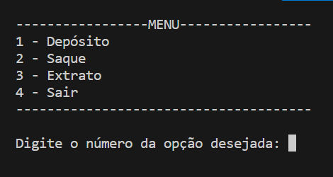
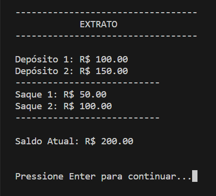

# Bootcamp Potência Tech - DIO Bank

  


# Sobre o Projeto

Desenolvido em Julho de 2023 durante o bootcamp **Potência Tech Powered by iFood | Ciência de Dados com Python!** oeferecido pela **DIO** em parceria com a **IFood**, o projeto apresenta uma aplicação console que possibilita as ações de Depósito, Saque e Extrato de um banco. Foram aplicados conceitos de orientação a objetos, seguindo as regras de negócio disponibilizadas durante o desafio.


# Índice

- <a href = "#Tecnologias-Utilizadas">Tecnologias Utilizadas</a>
- <a href = "#Como-Clonar-o-Projeto">Como Clonar o Projeto</a>
- <a href = "#Regras-de-Negócio">Regras de Negócio</a>
- <a href = "#Projeto">Projeto</a>
- <a href = "#Próximos-Passos">Próximos Passos</a>
- <a href = "#Autor">Autor</a>


# Tecnologias Utilizadas

- [Python 3.11.4](https://www.python.org/downloads/) 
- [Google Colab](https://colab.google/)
- [Visual Studio Code](https://code.visualstudio.com/download)


# Como Clonar o Projeto

- Instale o [Git](https://git-scm.com/downloads) no seu computador. Durante a instalação, certifique-se se a opção **Git Bash** está adicionada.
- Após a instalação, crie uma pasta em sua área de trabalho
- Dentro da pasta, clique com o botão direito e selecione **Git Bash Here**
- Após abrir o terminal, copie o seguinte comando:
   
```bash
git clone https://github.com/PhilTisoni/DIO_Bank.git
```
O projeto deverá ser clonado para a sua pasta. Abra o arquivo .py em seu compilador de preferência.


  
# Regras de Negócio

Fomos contratados por um grande banco para desenvolver o seu novo sistema. Esse banco deseja modernizar suas operações e para isso escolheu a línguagem Python. Para a primeira versão do sistema, devemos implementar apenas 3 operações: depósito, saque e extrato. A primeira versão do projeto trabalha com apenas um usuário, dessa forma, não precisamos nos preocupar em identificar qual é o número da agência e conta bancária. 

## Depósito:

- Deve ser possível depositar valores positivos para a conta bancária.
- Todos os depósitos devem ser armazenados em uma variável e exibidos na operação de extrato

## Saque:

- O sistema deve permitir realizar 3 saques diários com limite máximo de R$ 500.00 por saque
- Caso o usuário não tenha saldo em conta, o sistema deve exibir uma mensagem informando que não será possível sacar o dinheiro por falta de saldo
- Todos os saques devem ser armazenados em uma variável e exibidos na operação de extrato
 
## Extrato:

- Essa operação deve listar todos os depósitos e saques realizados na conta
- No fim da listagem, deve ser exibido o saldo atual da conta
- Os valores devem ser exibidos utilizando o formato R$ xxxx.xx, por exemplo: 1500.45 = R$ 1500.45


# Projeto

O código está divido em 4 partes: Menu, Funções do Sistema, Funções Bancárias e Exemplo. Procurou-se manter as boas práticas de programação e a aplicação de princípios [SOLID](https://www.dio.me/articles/mentoria-codigo-limpo-solid-e-boas-praticas) para a construção de um código limpo e de fácil manutenção.

## Menu

A lógica central do programa está na função **exibir()** da classe **Menu**, ele mostra as opções propostas pelo desafio e realiza algumas validações.



## Funções do Sistema

Essas duas funções são responsáveis por otimizar a execução e evitar a repetição de códigos:

```python
def retornar_menu(self):
        input('\n\nPressione Enter para continuar...')

    def limpar_tela(self):
         os.system('cls' if os.name == 'nt' else 'clear')  # Limpa a tela do console
```

A função **retornar_menu()** espera que o usuário aperte **Enter** para continuar a próxima etapa do processo, deixando o programa mais interativo. A segunda função **limpar_tela()** verifica através de uma condicional ternária qual é o sistema operacional utilizado pelo usuário, pois o comando de limpeza do terminal é diferente em relação ao Windows, Linux ou Mac.


## Funções Bancárias

Todas as funções possuem um cabeçalho informando o seu tipo (Depósito, Saque ou Extrato) e realizam as devidas verificações seguindo a regra de negócio proposta no desafio. Pensando na manutenção do código a longo prazo, optou-se por substituir a utilização de variáveis por listas, deste modo, ao executar um depósito ou saque, os dados foram adicionados através do **append()** na sua respectiva lista. Abaixo, é possível visualizar um exemplo na função **depositar()**.

```python
 def depositar(self): 
        self.limpar_tela()      
        print('----------------------------------')
        print('            DEPÓSITO')
        print('----------------------------------\n')
        deposito = float(input('Insira o valor do depósito: R$ '))

        if deposito <= 0:
            print('Não é possível depositar valores negativos ou iguais a R$ 0.00')
        else:
            self.saldo += deposito
            self.depositos.append(deposito)
            print(f'\nOperação realizada com sucesso. \nSaldo Atual: R$ {self.saldo:.2f}')
```

A função **exibir_extrato()** utilizou **enumerates** para facilitar a impressão dos dados na tela. Como se tratam de dados com chave e valor, adicionou-se um laço **for** com dois contadores, assim, é possível imprimir o número do depósito e a quantia adicionada na conta:

```python
 if self.depositos:            
            for i, deposito in enumerate(self.depositos, start=1):
                print(f'Depósito {i}: R$ {deposito:.2f}')
            print('---------------------------')
```




## Exemplo

Para exemplificar, ao final do código, foi inserido o valor de 100.00 para o saldo e preencheu-se as variáveis com as informações da regra de negócio, como o limite diário de R$ 500.00 e a quantidade de saques realizados.

```python
saldo = 100.00
depositos = []
saques = []
limite_diario = 500.00
quantidade_saques_realizados = 0

menu = Menu(saldo, depositos, saques, limite_diario, quantidade_saques)
menu.exibir()
```

# Próximos Passos

- [ ] Separar as funções em classes
- [ ] Incluir implementações do Desafio 2 após a finalização das aulas


# Autor

- [Phelipe Augusto Tisoni](https://www.linkedin.com/in/phelipetisoni "Phelipe Linkedin")
